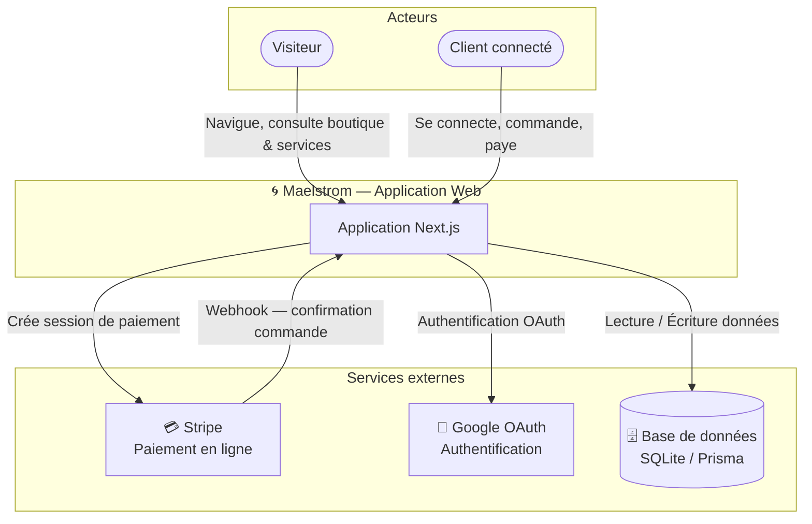
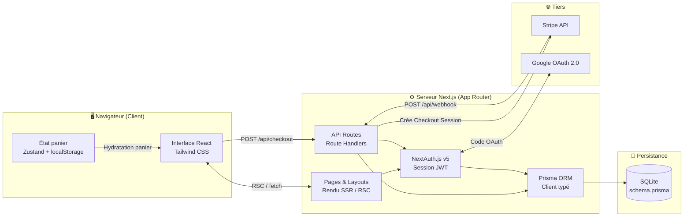
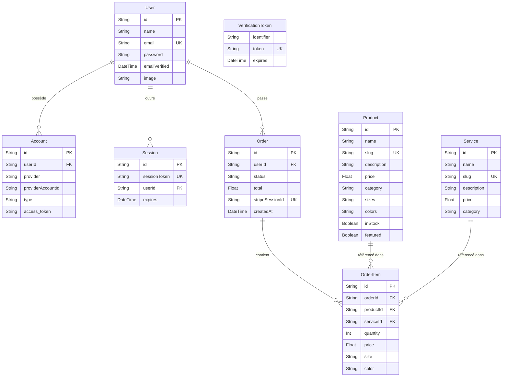
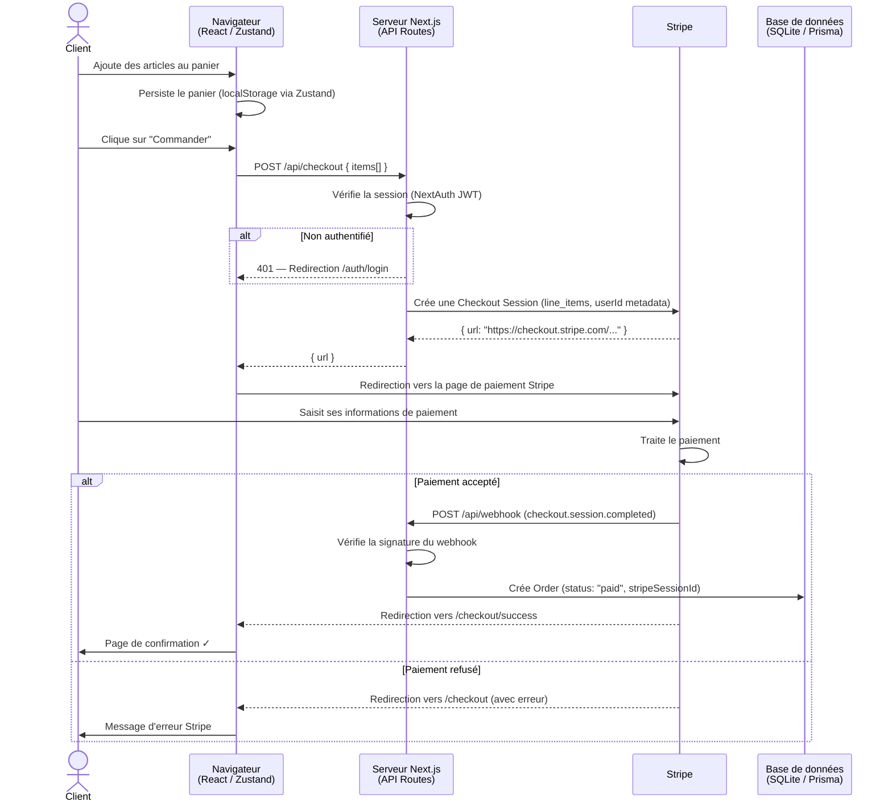

# Architecture — Maelstrom

> Application e-commerce de mode artisanale : vente de vêtements originaux et services de retouche couture.

---

## Sommaire

1. [Niveau 1 — Vue système globale](#niveau-1--vue-système-globale)
2. [Niveau 2 — Architecture en couches](#niveau-2--architecture-en-couches)
3. [Niveau 3 — Vue détaillée des modules](#niveau-3--vue-détaillée-des-modules)
4. [Schéma de la base de données](#schéma-de-la-base-de-données)
5. [Flux de commande (Séquence)](#flux-de-commande-séquence)

---

## Niveau 1 — Vue système globale

Vue macro des acteurs et des systèmes externes avec lesquels interagit l'application. Ce niveau répond à la question : **qui utilise quoi ?**

---

## Niveau 2 — Architecture en couches

Vue intermédiaire des grandes couches techniques de l'application. Next.js unifie le rendu côté serveur et côté client dans un seul déploiement (paradigme **fullstack monolithique**).

---

## Niveau 3 — Vue détaillée des modules

Vue fine de l'organisation interne du code source : pages, composants, couche `lib`, routes API et leurs dépendances.

```mermaid
graph TB
    subgraph src/app["📁 src/app  (Pages & Routes)"]
        direction TB
        P_HOME[page.tsx\nAccueil]
        P_BOUTIQUE[boutique/page.tsx\nCatalogue produits]
        P_PRODUIT["boutique/[id]/page.tsx\nFiche produit"]
        P_SERVICES[services/page.tsx\nServices retouche]
        P_PANIER[panier/page.tsx\nPanier]
        P_CHECKOUT[checkout/page.tsx\nRedirection Stripe]
        P_SUCCESS[checkout/success/page.tsx\nConfirmation]
        P_LOGIN[auth/login/page.tsx]
        P_REGISTER[auth/register/page.tsx]

        API_AUTH["api/auth/[...nextauth]/route.ts"]
        API_REGISTER[api/auth/register/route.ts]
        API_CHECKOUT[api/checkout/route.ts]
        API_WEBHOOK[api/webhook/route.ts]
    end

    subgraph src/components["📁 src/components"]
        NAVBAR[Navbar.tsx]
        FOOTER[Footer.tsx]
        PRODUCTCARD[ProductCard.tsx]
        SERVICECARD[ServiceCard.tsx]
        PROVIDERS[Providers.tsx\nSessionProvider]
    end

    subgraph src/lib["📁 src/lib"]
        LIB_AUTH[auth.ts\nNextAuth config]
        LIB_CART[cart.ts\nZustand store]
        LIB_DATA[data.ts\nDonnées statiques]
        LIB_PRISMA[prisma.ts\nClient Prisma]
        LIB_STRIPE[stripe.ts\nClient Stripe]
    end

    subgraph src/types["📁 src/types"]
        TYPES[index.ts\nProduct · Service · CartItem]
    end

    %% Pages → Lib
    P_BOUTIQUE --> LIB_DATA
    P_PRODUIT --> LIB_DATA
    P_SERVICES --> LIB_DATA
    P_PANIER --> LIB_CART
    P_CHECKOUT --> LIB_CART

    %% API Routes → Lib
    API_AUTH --> LIB_AUTH
    API_REGISTER --> LIB_PRISMA
    API_CHECKOUT --> LIB_AUTH
    API_CHECKOUT --> LIB_STRIPE
    API_WEBHOOK --> LIB_STRIPE
    API_WEBHOOK --> LIB_PRISMA

    %% Auth → Prisma
    LIB_AUTH --> LIB_PRISMA

    %% Components → Lib
    NAVBAR --> LIB_CART
    PRODUCTCARD --> TYPES
    SERVICECARD --> TYPES
```

---

## Schéma de la base de données

Modèle relationnel géré par **Prisma ORM** sur une base **SQLite**. Les tableaux JSON (`sizes`, `colors`, `images`) sont sérialisés en texte.

---

## Flux de commande (Séquence)

Déroulé complet d'une commande depuis le panier jusqu'à la confirmation, illustrant les interactions entre le navigateur, le serveur Next.js et Stripe.

